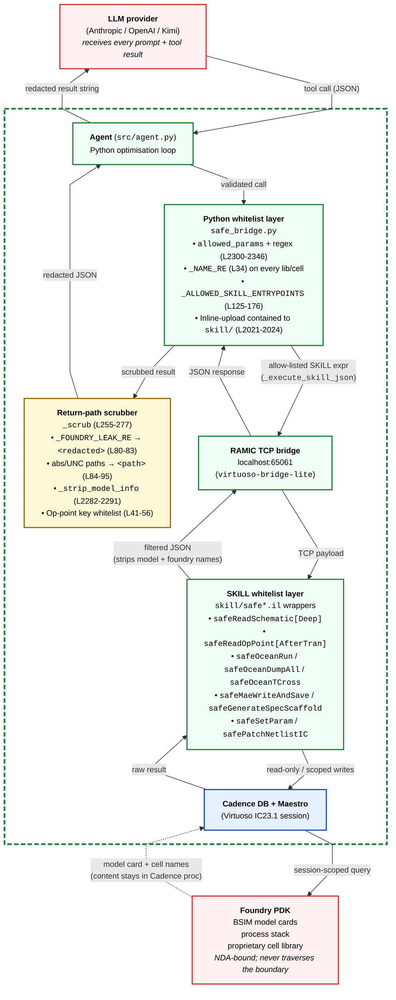

# Figure 1 — Safe-Bridge Architecture

Mermaid source for paper Figure 1. Renders directly on GitHub; final
PDF/PNG export will be regenerated with `mermaid-cli` (`mmdc -i
safe_bridge_arch.mmd -o safe_bridge_arch.pdf -w 1200`) during the
camera-ready pass.

The diagram has eight nodes plus a trust-boundary line. The
trust-boundary cuts between the LLM provider (untrusted, top) and
everything downstream; the PDK sits intentionally **outside** that
trusted region too — it is what the trusted region defends.

## Diagram

## Reading guide for the paper caption

> **Fig. 1 — Safe-Bridge architecture.** Untrusted nodes (red) bound
> the trust region (dashed green). The LLM provider sees only the
> agent's JSON tool calls and the scrubbed JSON responses; the PDK
> content stays inside the Cadence process and is filtered at two
> levels before any byte crosses back into Python — first by the SKILL
> wrappers (`safeOceanDumpAll` etc., which strip model and foundry
> names before serialising), then by `_scrub` (`safe_bridge.py:255-277`,
> regex-redacts any residual foundry tokens or absolute paths).
> Parameter names proposed by the LLM are validated against the
> per-project `allowed_params` whitelist before any SKILL invocation;
> SKILL expressions themselves are restricted to a 17-name entrypoint
> allow-list. The dashed PDK → Cadence arrow is intentional: the PDK
> content is *referenced* by Cadence during simulation but never
> serialised to the bridge.

## Numbered trust-boundary crossings (for the §3 prose to reference)

1. **LLM → Agent** — JSON tool call. The only thing the LLM is
   permitted to ship into the trust region. Validated by the Python
   whitelist layer before any SKILL call is constructed.
2. **Python WL → RAMIC** — allow-listed SKILL expression as a string.
   Constructed by `_execute_skill_json`
   (`safe_bridge.py:2139-2202`). All identifier and atom arguments
   passed through `_validate_name` / `_format_param_value`.
3. **RAMIC → SKILL WL** — TCP payload to localhost:65061. The wrappers
   (`skill/safe*.il`) re-validate arguments on the Cadence side.
4. **SKILL WL → Cadence DB** — session-scoped query. No file IO
   outside the Maestro / OCEAN working dirs; no `hiOpenLib` exposed.
5. **Cadence ↔ PDK** — internal to the Cadence process. Confidential
   PDK bytes are loaded into the simulator's memory but never
   serialised back through RAMIC.
6. **SKILL WL → RAMIC → Python WL → Scrub → Agent → LLM** — return
   path. SKILL strips model info and foundry-cell-name keys on
   the Cadence side; `_scrub` redacts anything that slips through on
   the Python side.

## Open issue noted by the threat model (cross-link)

Tier 3 of §4.3 covers the `reasoning_content` re-entry path: when the
LLM provider returns a thinking block alongside its content (Kimi K2.5,
MiniMax M2.7, o-series, etc.), the bridge previously did **not** scrub
it before `agent.py:610-612` re-appended the full response to the
conversation history. As of 2026-05-12 (task `e750189c`, dual-approved
by `claude_reviewer_v2` and `codex_reviewer_v2`), this gap is closed:
`KimiClient.chat`, `MiniMaxClient.chat`, and `OllamaClient.chat` now
return `scrub(reasoning)` / `scrub(thinking)` at
`llm_client.py:335, 427, 497`. The first-emission leg (the bytes
the model sends to its own provider before the agent ever sees them)
remains out of scope per §4.5; that distinction is what the
"replay" vs "first-emission" rows of Table 2 capture.

## Mermaid → PDF render notes (delete before submission)

- Run `mmdc -i safe_bridge_arch.mmd -o safe_bridge_arch.pdf -w 1200 -H 900`
  for the camera-ready PDF.
- For ACM single-column figure width, use `-w 800`.
- The `subgraph TRUST [" "]` trick gives us the dashed-green trust
  boundary without a label; if mermaid-cli renders the empty title
  badly, swap the `" "` for the literal word "trusted" and accept the
  label.
- If reviewers ask for a more conventional security-architecture style
  (data-flow lines crossing a vertical bar), we can swap in a TikZ
  redraw post-acceptance; for the submission deadline the Mermaid
  render is the right cost/benefit point.
